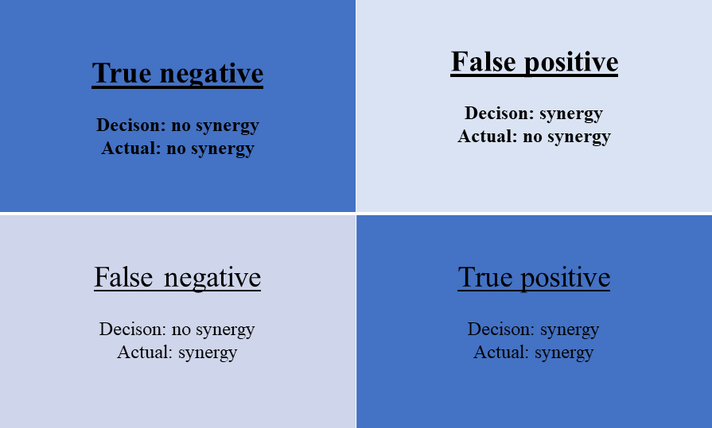

```{r, include = FALSE}
knitr::opts_chunk$set(
  collapse = TRUE,
  warning = FALSE,
  message = FALSE,
  #eval=FALSE,
  fig.align = "center",
  comment = "#>"
  
)
```

```{r setup,include=FALSE}
library(beemixtox1)
library(tidyverse)
library(knitr)
library(patchwork)
```

<style type="text/css">
.caption {
    font-size: small;
    font-weight: bold;
}
</style>


# Simulation based MDR analysis

Numerically speaking, potential synergy could be concluded if an experimental MDR is greater than 1. However, the observed difference in toxicity of the mixture with respect to the prediction under additivity could be due either a true toxicological interaction or simply variability (cv) during toxicity testing. To explore the relationship between simple experimental variability and MDR, we use simulation based methods where we can assume a specific level of variability of each mixture component and the mixture. Then we check the possibilities to distinguish between true synergistic effect and variability of the mixture components. 
For generating MDR values for perfectly additive mixtures, we followed the approach proposed by Belden and Brain (2018). Distributions of MDR values were generated that would occur for the combinations of perfectly additive chemicals (i.e., the same chemical mixed with itself) in which the variability in the resulting MDRs comes only from experimental variability. For this we assumed a log-normal distribution of LD50 values with a mean of 1 µg/bee, and a defined coefficient of variation (CV%) (30%, 60%, 100%, 140%, and 300%) and we randomly generated LD50s for two (for binary mixtures) or three (for Ternary mixtures) active substances and their combinations for 12000 simulations. For each of the 12000 simulations, an MDR was calculated, and the distribution of the MDRs was determined. The 95% of the MDR distributions is the MDR value that ensures a false positive rate equal to 5% (alpha 0.05). 

In Belden and Brain’s approach the simulation assumption is that the mixture contains perfectly additive chemicals and does not have true non-additive effect, which is the null hypothesis in the testing. However, it does not consider the case when the alternative hypothesis is true, (*i.e.*, when synergy does exist in the mixture). We further extended this framework to be able to investigate the true positive rates (power of the test to detect a true positive synergy that would be achieved when using different MDR thresholds). For this, LD50 means with a defined reduction factor were assumed for the mixture LD50 distribution as follows: for the 12000 simulation runs (for the case in which a true non-additive effect was modeled), LD50s for the single component in the mixture were sampled from a log-normal distribution with mean of 1 µg/bee, and a defined CV%, whereas the LD50s for the mixture were generated from a log-normal distribution with mean of 1/N µg/bee (N=2,5,10) and the same CV%. Note that the simulation truth is that there is a synergistic effect and the test using the given MDR should have enough power to identify the difference in toxicity between the mixture and the single components. The use of different MDR threshold and their corresponding true positive rates were then investigated. 


## Experimental variability driven MDR thresholds for synergy detection


To guide the selection of relevant CV% to simulate, experimental ecotoxicity data was collected from two different public sources: The first one was obtained from the USEPA ECOTOX Knowledgebase database (https://cfpub.epa.gov/ecotox/), and the second source was the OPP Pesticide Ecotoxicity Database (https://ecotox.ipmcenters.org/). The main difference between the databases is that USEPA ECOTOX Knowledgebase includes data from any public source with meet the data quality criteria for inclussion in the database, however, studies do not necessarily follow a specific guidelile, and chemicals are not restricted to any specific chemical group such as pesticides. By contrary, the OPP Pesticide Ecotoxicity Database includes only regulatory data that follow regulatory guidelines and that has been submitted by registrants of pesticidal products in the US. Both were interrogated against a series of query parameters to restrict the search to acute honey bee data for routes of exposure consistent with oral and contact exposure. Detailed explanation of the origin, curation and characteristics of the experimental data based on ECOTOX Knowledgesbase database can be found in `vignettes/articles/Ecotox-Database-Handling-and-Analysis.html`. The file to reproduce the pre-processing of the experimental data are included in the file `vignettes/articles/Ecotox-Database-Handling-and-Analysis.Rmd`. For the filtering and curation of the experimental data extracted from OPP Pesticide Ecotoxcity Database can be reproduced using `vignettes/articles/OPP-Database-Handling-and-Analysis.Rmd`

### Assessment of LD50 Data Homogeneity 

#### USEPA ECOTOX Knowledge base

Experimental bee data was obtained from the USEPA ECOTOX Knowledge base as described in the Material & Methods section of the main manuscript. Search criteria for the ECOTOX database were: **Habitat**: “terrestrial”, **Effect Measurements**: “Mortality Group: Mortality”, **Endpoints**: Concentration Based Endpoints: LD50”, **Species **: Name(s) / Number(s): “honey bee”, Kingdom: “Animals”, Name Search Type: “Common Name”, ** Test Conditions **: Test Locations: Lab.

A total of 21909 toxicity values for 578 different CAS numbers for honey bees were available at the database. This data however included a variety of bee life forms, exposure routes, exposure times, and other factors. Therefore, we restricted the dataset to ensure the relevant information was retained for the analysis. The main elements for data curation were: (1) restrict the data to adult life stage, (2) Subset to relevant exposure times (between 24h and 48 h). (3) restrict to defined (bound) end-points. (4) Restrict to exposure types consistent with an oral or contact exposure route. (4) Restrict to CAS numbers for which at least 4 toxicity end-points were available. All units were converted to ug/bee. Curation is documented in the "bee mixtox" data package freely available. After the data curation, 312 observations for 26 chemicals were available for further data analysis. Despite the data curation, the data available per CAS number was still relatively heterogeneous. In order to understand the sources of potential variability in the dataset and its degree of statistical heterogeneity we performed an ANOVA analysis. We found that the only statistically significant factor contributing to differences in LD50 was the chemical identity, being exposure route, exposure time, and concentration type not statistically significant factors explaining the differences observed in LD50. Therefore, all available LD50s per CAS numbers available were pulled together for further analysis.

```{r fig.width=8}
Data.2 <- Data.2 %>% mutate(logTox = log(Observed.Response.Mean))
mod = lm(log(Observed.Response.Mean) ~ CAS.Number + Conc.1.Type..Author. + Exposure.Type + Observed.Duration..Days., data = Data.2)
##summary(mod)
```

```{r}
options(knitr.kable.NA = '')
car::Anova(mod) %>% knitr::kable(.,digits = 3,caption="<center><strong>Table S-1: ANOVA Results in the USEPA ECOTOX Bee LD50 Data</strong></center>") %>% kableExtra::kable_classic()
```


As shown in the ANOVA Table in Table S-1, none of the covariate variables, except for CAS.Number,  has a significant effect on the observed response mean. 


#### OPP Pesticide Ecotoxicity Database

Bee toxicity data were extracted from the OPP Pesticide Ecotoxicity Database. The database was first filtered by test species being "Honey bee". A total of 2009 toxicity values for 515 different CAS numbers for honey bees were available at the database. Similar to the experimental data obtained from USEPA ECOTOX database, filtering and curation steps were performed to form a reliable dataset for further study of the LD50 distributions and for comparison with those derived from the USEPA ECOTOX database.  The main steps for data curation were: (1) restrict the data to adult life stage, (2) Subset to relevant exposure times (between 24h and 48 h). (3) restrict to defined (bound) end-points. (4) Restrict to exposure types consistent with an oral or contact exposure route. (4) Restrict to CAS numbers for which at least 4 toxicity end-points were available, (5) Exclude all mixture entries. All units were converted to ug/bee. Curation is documented in the "bee mixtox" data package freely available. 

After the data curation, 120 observations for 21 chemicals were available for further data analysis. Similar ANOVA was performed for OPP Pesticide BEE LD50 data to investigate the data homogeneity. The result table as shown in Table S-2 indicates that there is no significant different LD50s for different study durations or exposure types. The vairance in the LD50 data is mainly contributed from the different CAS in the dataset.  


```{r}
beetox_OPP <- beetox_OPP %>% mutate(logTox = log(tox))
mod = lm(log(tox) ~ CAS_NO+STUDYTIME+TYPE, data = beetox_OPP)

summary(mod)
```

```{r}
car::Anova(mod) %>% knitr::kable(.,digits = 3,caption="<center><strong>Table S-2: ANOVA Results in the OPP Pesticide Ecotoxicity Bee LD50 Data</strong></center>") %>% kableExtra::kable_classic()
```

### CV of the experimental data - Sensitivity Analysis

Both databases include pesticides evaluated both as active ingredients (technical grade materials) or formulated products. In both databases a field for purity or active ingredient content is provided, but reporting is heterogeneous (it is not reported for many chemicals). Further, there is no clear indication in either database on whether the LD50s provided in the database that are given for formulated products has been already expressed in terms of total active ingredient (with few exceptions identified in the database as e.g. ug ai/bee). Therefore, to account for the potential uncertainty emerging of this lack of complete information, summary statistics for the LD50s were computed both as reported in the database, and corrected by the available information concerning purity or content of active ingredient when available.

Table S-3 to S-10 shows the CV statistics with raw LD50 data and with AI content corrected LD50 data. 

```{r}
library(skimr)
cv <- function(x){
  sd(x)/mean(x)
}
my_skim <- skim_with(numeric = sfl(cv,nobs=length))

```


#### USEPA ECOTOX Knowledge base

Summary statistics for the USEPA ECOTOX dataset for the overall dataset and CAS by CAS number can be found below.

The chemical names were obtained using the [CompTox Chemicals Dashboard ](https://comptox.epa.gov/dashboard/batch-search). 


*USEPA ECOTOX Raw LD50*

```{r}
Data.2$CAS.Number <- webchem::as.cas(Data.2$CAS.Number)
#Data.3 <- left_join(Data.2,Data.SSD%>%mutate(CAS.Number=as.character(CAS.)))
Data.3 <- left_join(Data.2,casinfo,by=c("CAS.Number"="INPUT"))

cv_sum <- Data.3 %>% group_by(CAS.Number,PREFERRED_NAME) %>% summarise(mean_LD=mean(Observed.Response.Mean),sd_LD=sd(Observed.Response.Mean),cv=sd_LD/mean_LD)
cv_sum %>% ungroup() %>% my_skim()%>% yank("numeric") %>% dplyr::select(-c( n_missing,complete_rate)) %>% knitr::kable(.,digits=2,caption="<center><strong>Table S-3: Summary stats for overall CAS mean, sd, and CV for the USEPA ECOTOX bee raw LD50 data. </strong></center>",
    escape = FALSE)%>%kableExtra::kable_classic()

```


```{r}

Data.3 %>% group_by(CAS.Number,PREFERRED_NAME) %>% my_skim(Observed.Response.Mean) %>% yank("numeric") %>% dplyr::select(-c(skim_variable, n_missing,complete_rate)) %>% knitr::kable(.,digits=2,caption="<center><strong>Table S-4: Summary stats for LD mean, sd, and CV for each CAS with USEPA ECOTOX bee raw LD50 data</strong></center>",
    escape = FALSE)%>%kableExtra::kable_classic()
```

*USEPA ECOTOX Corrected by Purity*

```{r}
Data.3 <- Data.3 %>%filter(!is.na(Data.3$Observed.Response.Mean.t))
cv_sum <- Data.3 %>% group_by(CAS.Number,PREFERRED_NAME) %>% summarise(mean_LD.t=mean(Observed.Response.Mean.t),sd_LD.t=sd(Observed.Response.Mean.t),cv=sd_LD.t/mean_LD.t)
cv_sum %>% ungroup() %>% my_skim()%>% yank("numeric") %>% dplyr::select(-c( n_missing,complete_rate)) %>% knitr::kable(.,digits=2,caption="<center><strong>Table S-5: Summary stats for overall CAS LD mean, sd, and CV with USEPA ECOTOX bee corrected LD50 data </strong></center>",
    escape = FALSE)%>%kableExtra::kable_classic()

```


```{r}

Data.3 %>% group_by(CAS.Number,PREFERRED_NAME) %>% my_skim(Observed.Response.Mean.t) %>% yank("numeric") %>% dplyr::select(-c(skim_variable, n_missing,complete_rate)) %>% knitr::kable(.,digits=2,caption="<center><strong>Table S-6: Summary stats for LD mean, sd, and CV for each CAS with USEPA ECOTOX bee corrected LD50 data </strong></center>",
    escape = FALSE)%>%kableExtra::kable_classic()
```


#### OPP Pesticide Ecotoxicity Database

Summary statistics for the OPP dataset for he overall dataset and CAS by CAS number can be found below.


*OPP Raw LD50, Not corrected by AI column*

```{r}
cv_sum <- beetox_OPP %>% group_by(CAS_NO) %>% summarise(mean_LD=mean(tox),sd_LD=sd(tox),cv=sd_LD/mean_LD)
cv_sum %>% ungroup() %>% my_skim()%>% yank("numeric") %>% dplyr::select(-c( n_missing,complete_rate)) %>% knitr::kable(.,digits=2,caption="<center><strong>Table S-7: Summary stats for overall CAS LD mean, sd, and CV  in the OPP bee raw LD50 data </strong></center> ")%>%kableExtra::kable_classic()

```


```{r}

beetox_OPP %>% left_join(casinfo_OPP,by=c("CAS_NO"="INPUT"))%>% group_by(CAS_NO,PREFERRED_NAME) %>% my_skim(tox) %>% yank("numeric") %>% dplyr::select(-c(skim_variable, n_missing,complete_rate)) %>% knitr::kable(.,digits=2,caption="<center><strong>Table S-8: Summary stats for LD mean, sd, and CV for each CAS in the OPP bee raw LD50 data</strong></center>",
    escape = FALSE)%>%kableExtra::kable_classic()
```


*OPP LD50, corrected by AI column*

```{r}
cv_sum <- beetox_OPP %>% group_by(CAS_NO) %>% summarise(mean_LD=mean(tox_ai),sd_LD=sd(tox_ai),cv=sd_LD/mean_LD)
cv_sum %>% ungroup() %>% my_skim()%>% yank("numeric") %>% dplyr::select(-c( n_missing,complete_rate)) %>% knitr::kable(.,digits=2,caption="<center><strong>Table S-9: Summary stats for overall CAS LD mean, sd, and CV  in the OPP bee LD50 data corrected by AI content</strong></center> ")%>%kableExtra::kable_classic()

```


```{r}

beetox_OPP %>% left_join(casinfo_OPP,by=c("CAS_NO"="INPUT"))%>% group_by(CAS_NO,PREFERRED_NAME) %>% my_skim(tox_ai) %>% yank("numeric") %>% dplyr::select(-c(skim_variable, n_missing,complete_rate)) %>% knitr::kable(.,digits=2,caption="<center><strong>Table S-10: Summary stats for LD mean, sd, and CV for each CAS in the OPP bee LD50 data corrected by AI content</strong></center>",
    escape = FALSE)%>%kableExtra::kable_classic()
```


### MDR (Mixture Deviation Ratio) thresholds 

$$MDR = \frac{LD_{50,predicted}}{LD_{50,measured}}$$


In the first simulation study we performed simulations as in Belden and Brain to determine the 95th of MCR values that reject the Null Hypothesis that the MCR values is greater than 1. Where the MDR is greater than one, this indicates that the experimental (measured) endpoint is smaller than the predicted endpoint, and therefore, that the experimental toxicity is higher than expected under the additivity assumption. 

Values were generated for each toxicity test that would be conducted in a mixture study. For example, for a binary mixture AB, a value would be generated for compound A, compound B, and mixture AB.


- assumed a log-normal distribution based on specific CV value and randomly generated effective concentrations for theoretical active ingredients and a formulation mixture centered around a "true" value of 1 (10 000 iterations).
    - For example, for a binary mixture AB, a value would be generated for compound A, compound B, and mixture AB.  Each value was generated assuming a mean value 1 $\mu$g/bee.  
- For each iteration, an MDR was calculated. 
- The distribution of the resulting MDR values was then determined
- We repeated this process for CVs of 30%, 60%, 100%, 140%, and 300%.
- We conducted the analysis for binary and Ternary mixtures.


Note that the assumption is that we can use cv and given mean to calculate mean and variance, which could then being tranformed to the log-mean and log-sd of the assumed log-normal distribution. 

For each iteration, the resulting values for the active ingredients were used in *Concentration Addition Model* and by assuming a 1:1 mix the expected LD50 for the mixture was determined.

The idea here is: using the simulation samples generated based on the different CV% levels, we can determine the proportion of samples that would be classified wrongly as synergistic (when we know they are additive) if using the following reference levels of threshold MDR:  2, 3, 5, 10.


```{r eval=F,include=F}
mean_sim <- 1
cv <- c(0.6,1,1.4)
sd_sim <- cv*mean_sim
v_sim <- sd_sim^2
mu <- log(mean_sim/sqrt(1+v_sim/mean_sim^2))
sigma <- sqrt(log(1+v_sim/mean_sim^2))
```

```{r eval=F,include=F}
  MDRs <- sapply(1:Nsim,function(i){
    ECx <- rlnorm(nmix+1,meanlog = mu,sdlog=sigma)
    ECx_mix <- 1/(sum(p/ECx[1:nmix]))
    MDR <- ECx_mix/(ECx[1+nmix])
    MDR
  })
```


```{r}
cvs <- c(0.3,0.6,1,1.4,3)
# mdrs <- c(1.25,2,3,5)
mdrs <- c(2,3,5,10)
Nsim <- 10000
Nout <- 100
set.seed(100) ## to make the results reproducible
```


```{r fig.cap="Figure S1: ECDF of MDR for binary mixture with the same compound mixed with itself under different simulation coditions"}
res2 <- simCVn(cvs=cvs,mean_sim=1,p=c(0.5,0.5),Nsim=Nsim,synergy = F)

c2 <-res2%>%group_by(CV)%>% nest() %>% mutate(confusion=purrr::map(data,function(df) sapply(mdrs,function(x) sum(df>x)/Nsim)))%>% mutate(Mixture=2) %>% dplyr::select(-data) %>% unnest(cols=c(confusion)) %>% ungroup %>% mutate(cutoff=rep(mdrs,length(cvs))) %>% pivot_wider(names_from = cutoff,names_prefix="MDR>",values_from=confusion)

r2 <- res2%>%group_by(CV)%>% summarise(mean=mean(MDR),q95=quantile(MDR,0.95))%>% mutate(Mixture=2)
# ggplot(res2, aes(MDR,col=CV)) + stat_ecdf(geom = "point")+xlim(c(1,7))+ylab("")
res2$CV <- plyr::mapvalues(res2$CV,from=c(0.3,0.6,1,1.4,3),to=paste0(cvs*100,"%"))
r2$CV <- plyr::mapvalues(r2$CV,from=c(0.3,0.6,1,1.4,3),to=paste0(cvs*100,"%"))
res2$CV <- factor(res2$CV,levels=unique(res2$CV))
r2$CV <- factor(r2$CV,levels=unique(r2$CV))
p_sim_H0 <- ggplot(res2, aes(MDR,col=CV)) + stat_ecdf(geom = "step")+xlim(c(1,8))+ylab("")+geom_text(data=r2,aes(x=q95,y=seq(0.1,0.9,length=5),label = paste(formatC(q95)),col=CV))+geom_vline(data=r2,aes(xintercept = q95,col=CV),lty=2)
p_sim_H0+ggtitle("Binary Mixure")
```


```{r fig.cap="Figure S2: ECDF of MDR for ternary mixture with the same compound under different simulation coditions"}
res3 <- simCVn(cvs=cvs,mean_sim=1,p=c(1/3,1/3,1/3),Nsim=Nsim,synergy = F)


c3 <-res3%>%group_by(CV)%>% nest() %>% mutate(confusion=purrr::map(data,function(df) sapply(mdrs,function(x) sum(df>x)/Nsim)))%>% mutate(Mixture=3) %>% dplyr::select(-data) %>% unnest(cols=c(confusion)) %>% ungroup %>% mutate(cutoff=rep(mdrs,length(cvs))) %>% pivot_wider(names_from = cutoff,names_prefix="MDR>",values_from=confusion)

r3 <- res3%>%group_by(CV)%>% summarise(mean=mean(MDR),q95=quantile(MDR,0.95))%>% mutate(Mixture=3)

res3$CV <- plyr::mapvalues(res3$CV,from=c(0.3,0.6,1,1.4,3),to=paste0(cvs*100,"%"))
r3$CV <- plyr::mapvalues(r3$CV,from=c(0.3,0.6,1,1.4,3),to=paste0(cvs*100,"%"))
res3$CV <- factor(res3$CV,levels=unique(res3$CV))
r3$CV <- factor(r3$CV,levels=unique(r3$CV))
## ggplot(res3, aes(MDR,col=CV)) + stat_ecdf(geom = "point")+xlim(c(1,7))+ylab("")
ggplot(res3, aes(MDR,col=CV)) + stat_ecdf(geom = "step")+xlim(c(1,15))+ylab("")+geom_text(data=r3,aes(x=q95,y=seq(0.1,0.9,length=5),label = paste(formatC(q95)),col=CV))+geom_vline(data=r3,aes(xintercept = q95,col=CV),lty=2)+ggtitle("Ternary Mixtures")
# ggplot(res3, aes(MDR,col=CV)) + geom_density()+scale_x_log10()+geom_text(data=r3,aes(x=q95,y=seq(0.1,2,length=5),label = paste(formatC(q95)),col=CV))+geom_vline(data=r3,aes(xintercept = q95,col=CV),lty=2)+ggtitle("Ternary Mixtures")
```

```{r}
rbind(c2,c3)%>% relocate(Mixture, .before = CV)%>%mutate(CV=paste0(as.numeric(CV)*100,"%"))%>%mutate(Mixture=plyr::mapvalues(Mixture,from=c(2,3),to=c("Binary","Ternary"))) %>% knitr::kable(.,digits=3,caption="<strong><center> False Postive Rates using different MDR thresholds in one simulation run</strong></center>", escape = FALSE) %>%kableExtra::kable_paper(c("striped"),full_width = T) %>%kableExtra::collapse_rows(columns = 1)
```


```{r fig.cap="Figure S3: False Positives when there is no synergy with different MDR thresholds"}

confusion <- rbind(c2,c3) 
confusion$CV <- plyr::mapvalues(confusion$CV,from=c(0.3,0.6,1,1.4,3),to=paste0(cvs*100,"%"))
confusion$CV <- factor(confusion$CV,levels=unique(r2$CV))
confusion <- confusion %>% pivot_longer(cols = starts_with("MDR"))%>%mutate(name=factor(name,levels=unique(name))) %>% mutate(Mixture=plyr::mapvalues(Mixture,from=c(2,3),to=c("Binary","Ternary")))

ggplot(confusion,aes(x=name,y=value,col=CV))+geom_point()+geom_line(aes(group=CV))+facet_grid(.~Mixture)+theme(axis.text.x = element_text(angle = 90))+ scale_y_continuous(labels = scales::percent_format(accuracy = 1))+geom_hline(yintercept = 0.05,lty=2)+xlab("MDR Threshold")
```


```{r}
res <- rbind(r2,r3)
d95 <- res %>% select(-mean) %>% pivot_wider(names_from = CV,names_prefix="CV=",values_from=q95) # %>%mutate(name=factor(name,levels=unique(name)))## %>% knitr::kable(.)
```


```{r}
dmean <- res%>% select(-q95) %>% pivot_wider(names_from = CV,names_prefix="CV=",values_from=mean) ## %>% knitr::kable(.)

```

```{r}
knitr::kable(
  dmean,
  caption = 'Mean MDR when ther is no synery under different CV',
  digits = 3
)%>%kableExtra::kable_classic(.)
```


```{r}
d95 %>% knitr::kable(.,caption="<strong>Table S-11: 95th %tile of the Simulated MDRs based on additive mixture assumption (Same compound is being mixed with itself in the mixture)</strong>",
    escape = FALSE,digits = 2)%>%kableExtra::kable_classic()
```

### Extending Belden and Brian (2018) to using alternative assumption as simulation truth

In the 2nd simulation study, for each reduction factor N ($N=2,5,10$). for the 12,000 simulation runs 
1. LD50s for the single component in the mixture were sampled from a log-normal distribution with mean of 1 µg/bee, and a defined CV%, whereas the LD50s for the mixture were generated from a log-normal distribution with mean of 1/$N$ µg/bee and the same CV%. Note that the simulation truth is that there is synergism effect and the test using the given MDR (or the decision made given using different MDR thresholds) should have enough power to identify the difference in toxicity between the mixture and the single components instead of keeping the false positive rates low enough when the simulation truth is that "there is no synergism effect".

Similar to the previous simulation, an MDR was calculated for each simulation run. The distribution of the resulting MDR values was then determined. We repeated this process for CVs of 30%, 60%, 100%, 140% and 300%.  We also conducted the analysis for binary and Ternary mixtures.The proportion of samples that would be classified correctly as synergistic if using the following reference levels of threshold MDR:  2, 3, 5, 10 are calulated.

For each CV and MDR threshold combination, the confusion matrix were calculated and summarized in Table S4-S6. The aim is to find a balancing point where the false positive rates is low enough (below 5% or 10%) and the power to detect the true synergism effect is high enough (above 75% or 80%). When the CV is high and the synergism effect is low, it is naturally hard to distinguish between the toxicity variability within one single component of the mixture and the synergism effect caused by a true synergy. Low MDR thresholds would provide enough power for detecting a true effect but would have a high false positive rates when there is actually no such effect. When the CV is low or medium, for example, when CV is between 30% and 100%,  it is possible to use MDR of 5 to detect a reasonable size of synergistic effect (reduction factor greater than 5) with true positive rates around 70% and false positive rates below 5%. On the other hand, it is not possible to find a balancing point for synergism effect with a reduction factor of 2, even with the lowest CV used in the simulation, the true positive rate is always below 60%. This means that the test itself lacks the required accuracy to detect a 2x difference between the predicted and experimental toxicity.


```{r fig.cap="Figure S4: Confusion Matrix"}

```

**Confusion matrix and quantiles for MDR**

```{r fig.cap="Figure S5: False Positive Rate when there is no synergy"}
Res_Null <- simConfusion (cvs=c(0.3,0.6,1,1.4,3),
                         mdrs=c(2,3,5,10),
                         Nsim=12000,
                         synergy=F,q=0.95)
sim_H0 <- ggplot(Res_Null$confusion%>%mutate(CV=paste0(as.numeric(CV)*100,"%"))%>% mutate(CV=factor(CV,levels=unique(CV)))%>%mutate(Mixture=plyr::mapvalues(Mixture,from=c(2,3),to=c("Binary","Ternary"))),aes(x=name,y=value,col=CV))+geom_point()+geom_line(aes(group=CV))+facet_grid(.~Mixture)+theme(axis.text.x = element_text(angle = 90))+ scale_y_continuous(labels = scales::percent_format(accuracy = 1))+geom_hline(yintercept = 0.05,lty=2)+xlab("MDR Threshold")+ylab("False Positive Rate")+ggtitle("No Synery")
```


```{r fig.cap="Figure S6: Power to detect synery when there is a reduction factor of 2"}
Res_Alt <- simConfusion (cvs=c(0.3,0.6,1,1.4,3),
                         mdrs=c(2,3,5,10),
                         Nsim=12000,
                         synergy=T,reduction=0.5,q=0.95)

sim_H2 <- ggplot(Res_Alt$confusion%>%mutate(CV=paste0(as.numeric(CV)*100,"%"))%>% mutate(CV=factor(CV,levels=unique(CV)))%>%mutate(Mixture=plyr::mapvalues(Mixture,from=c(2,3),to=c("Binary","Ternary"))),aes(x=name,y=value,col=CV))+geom_point()+geom_line(aes(group=CV))+facet_grid(.~Mixture)+theme(axis.text.x = element_text(angle = 90))+ scale_y_continuous(labels = scales::percent_format(accuracy = 1))+geom_hline(yintercept = 0.8,lty=2)+xlab("MDR Threshold")+ggtitle("True Synergy: Factor of 2")+ylab("True Positive Rate")
```


```{r}
Res_Alt$confusion$Truth <- "synergy"
Res_Null$confusion$Truth <- "No synergy"
tmp <- rbind(Res_Null$confusion,Res_Alt$confusion)%>%pivot_wider(names_from = Truth,values_from=value)%>%mutate(Decision="Reject H0")

confusion <- rbind(tmp,tmp %>% mutate(`No synergy`=1-`No synergy`,synergy=1-synergy,Decision="Do not reject H0"))

conf <- confusion %>% group_by(Mixture,CV,name) %>% nest() %>% mutate(data=purrr::map(data,function(df){
  df[2:1,c(3,1,2)]%>%mutate(`No synergy`=paste0(c("True Negative=","False Positive="),formatC(`No synergy`*100,digits = 1,format="f"),"%"),synergy=paste0(c("False Negative=","True Positive="),formatC(synergy*100,digits = 1,format="f"),"%"))
}))%>%unnest(cols = c(data))
library(kableExtra)
conf2 <- conf %>% rename(`Synery Factor 2`=synergy)
## conf %>% knitr::kable(., "markdown")
```


```{r eval=F,include=F}
conf %>% relocate(Mixture, .before = CV)%>%mutate(CV=paste0(as.numeric(CV)*100,"%"))%>%mutate(Mixture=plyr::mapvalues(Mixture,from=c(2,3),to=c("Binary","Ternary"))) %>% knitr::kable(., "html",caption="<center><strong>Table S-12: The Confusion Matrix using different MDR thresholds when reduction factor is 2</strong></center>", escape = FALSE) %>%kable_paper(c("striped"),full_width = T) %>% collapse_rows
```


```{r}
Res_Alt <- simConfusion (cvs=c(0.3,0.6,1,1.4,3),
                         mdrs=c(2,3,5,10),
                         Nsim=12000,
                         synergy=T,reduction=0.8,q=0.95)

sim_H5 <- ggplot(Res_Alt$confusion%>%mutate(CV=paste0(as.numeric(CV)*100,"%"))%>% mutate(CV=factor(CV,levels=unique(CV)))%>%mutate(Mixture=plyr::mapvalues(Mixture,from=c(2,3),to=c("Binary","Ternary"))),aes(x=name,y=value,col=CV))+geom_point()+geom_line(aes(group=CV))+facet_grid(.~Mixture)+theme(axis.text.x = element_text(angle = 90))+ scale_y_continuous(labels = scales::percent_format(accuracy = 1))+geom_hline(yintercept = 0.8,lty=2)+xlab("MDR Threshold")+ggtitle("True Synergy: Factor of 5")+ylab("True Positive Rate")
```


```{r}
Res_Alt$confusion$Truth <- "synergy"

Res_Null$confusion$Truth <- "No synergy"
tmp <- rbind(Res_Null$confusion,Res_Alt$confusion)%>%pivot_wider(names_from = Truth,values_from=value)%>%mutate(Decision="Reject H0")

confusion <- rbind(tmp,tmp %>% mutate(`No synergy`=1-`No synergy`,synergy=1-synergy,Decision="Do not reject H0"))

conf <- confusion %>% group_by(Mixture,CV,name) %>% nest() %>% mutate(data=purrr::map(data,function(df){
  df[2:1,c(3,1,2)]%>%mutate(`No synergy`=paste0(c("True Negative=","False Positive="),formatC(`No synergy`*100,digits = 1,format="f"),"%"),synergy=paste0(c("False Negative=","True Positive="),formatC(synergy*100,digits = 1,format="f"),"%"))
}))%>%unnest(cols = c(data))
library(kableExtra)
conf5 <- conf %>% rename(`Synery Factor 5`=synergy)
## conf %>% knitr::kable(., "markdown")
```

```{r eval=F,include=F}
#conf %>% knitr::kable(., "html",caption="<center><strong>Table S5: Confusion matrix with reduction factor of 5</strong></center>", escape = FALSE) %>%kable_paper(full_width = T) %>% collapse_rows

conf %>% relocate(Mixture, .before = CV)%>%mutate(CV=paste0(as.numeric(CV)*100,"%"))%>%mutate(Mixture=plyr::mapvalues(Mixture,from=c(2,3),to=c("Binary","Ternary"))) %>% knitr::kable(., "html",caption="<center><strong>Table S5: The Confusion Matrix using different MDR thresholds when reduction factor is 5</strong></center>", escape = FALSE) %>%kable_paper(c("striped"),full_width = T) %>% collapse_rows
```


```{r}
Res_Alt <- simConfusion (cvs=c(0.3,0.6,1,1.4,3),
                         mdrs=c(2,3,5,10),
                         Nsim=12000,
                         synergy=T,reduction=0.9,q=0.95)

sim_H10 <- ggplot(Res_Alt$confusion%>%mutate(CV=paste0(as.numeric(CV)*100,"%"))%>% mutate(CV=factor(CV,levels=unique(CV)))%>%mutate(Mixture=plyr::mapvalues(Mixture,from=c(2,3),to=c("Binary","Ternary"))),aes(x=name,y=value,col=CV))+geom_point()+geom_line(aes(group=CV))+facet_grid(.~Mixture)+theme(axis.text.x = element_text(angle = 90))+ scale_y_continuous(labels = scales::percent_format(accuracy = 1))+geom_hline(yintercept = 0.8,lty=2)+xlab("MDR Threshold")+ggtitle("True Synergy: Factor of 10")+ylab("True Positive Rate")
```


```{r}
Res_Alt$confusion$Truth <- "synergy"
Res_Null$confusion$Truth <- "No synergy"
tmp <- rbind(Res_Null$confusion,Res_Alt$confusion)%>%pivot_wider(names_from = Truth,values_from=value)%>%mutate(Decision="Reject H0")

confusion <- rbind(tmp,tmp %>% mutate(`No synergy`=1-`No synergy`,synergy=1-synergy,Decision="Do not reject H0"))

conf <- confusion %>% group_by(Mixture,CV,name) %>% nest() %>% mutate(data=purrr::map(data,function(df){
  df[2:1,c(3,1,2)]%>%mutate(`No synergy`=paste0(c("True Negative=","False Positive="),formatC(`No synergy`*100,digits = 1,format="f"),"%"),synergy=paste0(c("False Negative=","True Positive="),formatC(synergy*100,digits = 1,format="f"),"%"))
}))%>%unnest(cols = c(data))
library(kableExtra)

##conf %>% knitr::kable(., "markdown")
conf10 <- conf %>% rename(`Synery Factor 10`=synergy)
```

```{r eval=F,include=F}
#conf %>% knitr::kable(., "html",caption="<center><strong>Table S5: Confusion matrix with reduction factor of 10</strong></center>", escape = FALSE) %>%kable_paper(full_width = T) %>% collapse_rows

conf %>% relocate(Mixture, .before = CV)%>%mutate(CV=paste0(as.numeric(CV)*100,"%")) %>%mutate(Mixture=plyr::mapvalues(Mixture,from=c(2,3),to=c("Binary","Ternary"))) %>% knitr::kable(., "html",caption="<center><strong>Table S6: The Confusion Matrix using different MDR thresholds when reduction factor is 10</strong></center>", escape = FALSE) %>%kable_paper(c("striped"),full_width = T) %>% collapse_rows(columns = c(1,2,3))
```


```{r fig.cap="Figure S5: True and false positive rates under different synergy assumption",fig.align="center",fig.width=12,fig.height=7}
library(patchwork)

sim_H0+sim_H2+sim_H5+sim_H10+plot_annotation(tag_levels = 'A')+ plot_layout(guides = "collect")
if(interactive()) ggsave(file="inst/manuscript/Figure3.png",width=12,height=7,dpi=300)

```


```{r}
confall <- left_join(conf2,conf5)
confall <- left_join(confall,conf10)
confall %>% relocate(Mixture, .before = CV)%>%mutate(CV=paste0(as.numeric(CV)*100,"%"))%>%mutate(Mixture=plyr::mapvalues(Mixture,from=c(2,3),to=c("Binary","Ternary"))) %>% knitr::kable(., "html",caption="<center><strong>Table S-13: The Confusion Matrix using different MDR thresholds when reduction factor is 2, 5, and 10 </strong></center>", escape = FALSE) %>%kable_paper(c("striped"),full_width = T) %>% collapse_rows(columns = c(1,2,3))
```


## Confidence bands for MDR threholds


The MDR thresholds in Table x is based on the non-synergy simulation were derived based on 1 replicates of the simulation procedure. The simulation could be repeated 100 times and the summary stats for the MDR threshold based on the mean or on the 95th %tile could be estimated, as shown in Table S6. 

```{r fig.cap="Figure S6: Distrubtions of MDRs of 100 repeated simulations."}
df <- simCVmat(cvs=c(0.6,1,1.4),mean_sim=1,p=c(0.5,0.5),Nsim=5000,M=100)
df1 <- df%>% pivot_longer(cols = starts_with("Rep"),names_to="Replicate",values_to="MDR")
ggplot(df1,aes(x=MDR,col=CV)) + geom_density(aes(group=Replicate))+scale_x_log10()+facet_grid(.~CV)

MDRdist <- df1 %>% group_by(CV,Replicate) %>% summarise(mean=mean(MDR),q95=quantile(MDR,0.95))

skimr::skim(MDRdist)%>% yank("numeric") %>% select(-c( n_missing,complete_rate)) %>% knitr::kable(.,digits=2,caption="<center><strong>Table S6: Summary stats for the simulated MDR mean and 95th percentiles </strong></center>", escape = FALSE) %>%kableExtra::kable_classic()
```


```{r fig.cap="Figure S7:The boxplot of MDR means and 95th %tiles from 100 repeated simulations"}
MDRdist1 <- MDRdist %>% pivot_longer(cols = c(mean,q95),names_to="stats",values_to="value")
ggplot(MDRdist1,aes(x=CV,y=value))+geom_boxplot()+geom_point()+facet_grid(.~stats)#+scale_y_log10()

```


```{r eval=F,include=F}

df <- simCVmat(cvs=c(0.6,1,1.4),mean_sim=1,p=c(0.5,0.5),Nsim=5000,M=100,synergy=T)
df1 <- df%>% pivot_longer(cols = starts_with("Rep"),names_to="Replicate",values_to="MDR")
ggplot(df1,aes(x=MDR,col=CV)) + geom_density(aes(group=Replicate))+scale_x_log10()+facet_grid(.~CV)

MDRdist <- df1 %>% group_by(CV,Replicate) %>% summarise(mean=mean(MDR),q95=quantile(MDR,0.95))

skimr::skim(MDRdist)
MDRdist1 <- MDRdist %>% pivot_longer(cols = c(mean,q95),names_to="stats",values_to="value")
ggplot(MDRdist1,aes(x=CV,y=value))+geom_boxplot()+geom_point()+facet_grid(.~stats)#+scale_y_log10()


```


```{r eval=F,include=F}
tmp <- simConfusion_2mixture(mdrs = seq(1,10,by=0.02))
tmp$confusion$CV <- plyr::mapvalues(tmp$confusion$CV,from=unique(tmp$confusion$CV),to=paste0(as.numeric(unique(tmp$confusion$CV))*100,"%"))
tmp$confusion$CV<- factor(tmp$confusion$CV,levels=unique(tmp$confusion$CV))
ggplot(tmp$confusion,aes(x=MDR,y=value,col=CV))+geom_point()+geom_line(aes(group=CV))+facet_grid(.~Mixture)+theme(axis.text.x = element_text(angle = 90))+ scale_y_continuous(labels = scales::percent_format(accuracy = 1))+geom_hline(yintercept = 0.05,lty=2)+xlab("MDR Threshold")+ggtitle("Simulation based on H_0: Additive Mixture")
```


```{r}
factorV <- c(2,3,5,10)
reductionV <- 1-1/factorV
mdrs <- seq(1,10,by=0.02)


resAll <- lapply(1:length(reductionV),function(i){
  tmp1 <- simConfusion_2mixture(mdrs = mdrs,synergy = T,reduction = reductionV[i])
  return(tmp1)
})
resAll0 <- list()
resAll0[[1]] <- tmp
resAll <- c(resAll0,resAll)
names(resAll) <- c(1,factorV)  #paste0("reduction=",c(0,reductionV))
resDF <- plyr::ldply(lapply(resAll,function(x)x$confusion))
resDF$.id <- factor(resDF$.id,levels=c(1,2,3,5,10))
resDF$reduction.factor <- resDF$.id
resDF$CV <-  plyr::mapvalues(resDF$CV,from=c(0.3,0.6,1,1.4,3),to=paste0(cvs*100,"%"))
resDF$CV <- factor(resDF$CV,levels=unique(resDF$CV))
p1 <- ggplot(resDF,aes(x=MDR,y=value,col=reduction.factor))+geom_point(pch=".")+geom_line(aes(group=.id))+facet_grid(.~CV)+theme(axis.text.x = element_text(angle = -90))+ scale_y_continuous(labels = scales::percent_format(accuracy = 1))+geom_hline(yintercept = 0.05,lty=2)+xlab("MDR Threshold")+geom_hline(yintercept = 0.80,lty=2,col="darkblue")+theme(legend.position = "top")+guides(title="Reduction Factor")+geom_vline(xintercept = c(1.25,2,3,5),lty=3,col="darkblue")+scale_x_continuous(breaks = c(2,3,5,7.5,10))+ylab("")+see::scale_color_metro_d()
## if(interactive())ggsave("inst/manuscript/MDRcut-off.png")

```


```{r fig.cap="Figure S8. MDR thresholds based on simulated LD50s for different CV%."}
library(patchwork)
theme_set(theme_bw())
(p_sim_H0+theme(legend.position = "top"))/p1+ plot_annotation(tag_levels = 'A')
if(interactive())ggsave("inst/manuscript/figure4.png",width=7,height=7,dpi=300)
```

Note that Figure S8 is based on 1 simulation run. These thresholds varies for each simulation. In panel B, the upper dashed horizontal lines represents 80% power line whereas the lower dashed horizontal line represents the  5% type I error line. For the black curve where the deviation factor is 1, meaning that the mixture of the two components have the same mean and cv as each of the single component. In this case, type I error of falsely identifying a non-existing synergist effect should be avoided, for CV = 100%, as shown in the plot, when using MDR > 5 as a cutoff value, there is less than 5% of chance of making type I error.  On the other hand, for the colored curves where the simulation truth assumes a deviation factor greater than 1, an MDR cutoff value should be smaller than a certain value so that there is more than 80% of chance of identifying the known synergistic effect.  For example, for the yellow curve where the deviation factor is 5, for CV=100%, when MDR < 3, we are confident that we have less than 20% of chance of making type II error. 

